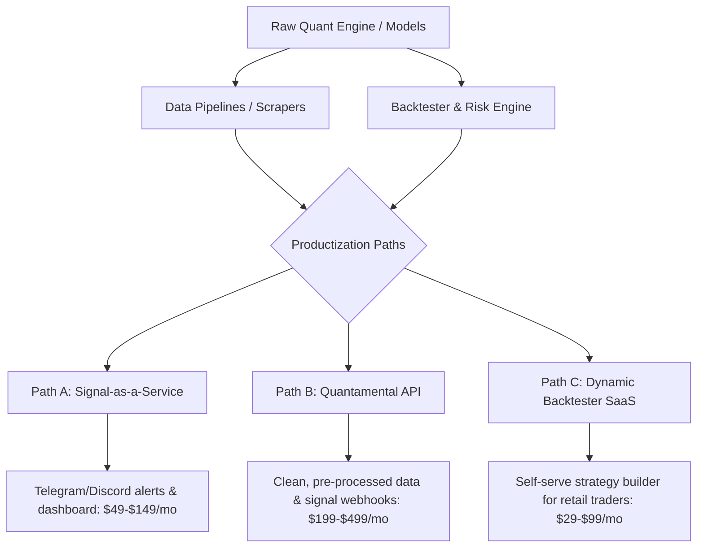

# Modern Money-Making Machines: Software-Driven Income Engines
*A Deep-Dive Research Report on High-Margin, Automatable Software Products for Solo Developers & Small Teams*

---

## Executive Summary
A **"money-making machine"** is a software system with high operational leverage: high upfront development effort, low ongoing variable costs, automated distribution or execution, and strong pricing power. 

In the current market landscape (2025–2026), the general-purpose "Swiss Army knife" SaaS is declining due to saturation. Instead, **hyper-specialized, data-rich, vertical micro-SaaS systems** and **automated data engines** are capturing massive value. 

This research explores the five most practical, high-margin software systems that can be built by a single skilled developer or small team, complete with execution strategies, technical architectures, and monetization models.

---

## Engine 1: Quantitative Trading & Signal Productization
*Leveraging quantitative models, backtesting engines, and automated alerts to create a subscription-based cash flow.*

Since you have an active project involving stock market models, backtesting, and Telegram alerts, this is your most immediate high-leverage path. Instead of trading with only your own capital (which limits scale), you can productize your infrastructure.

### The Monetization Architectures



#### Path A: Signal-as-a-Service (Telegram/Discord & Webhook Alerts)
*   **The Concept:** You run your quantitative models on your own servers. When specific setups occur (e.g., market regime filters shift, confidence-based tiers trigger), the engine automatically dispatches alerts to private Telegram/Discord channels or custom webhooks.
*   **Target Audience:** Retail momentum/swing traders, part-time investors who want institutional-grade filtering without the complexity.
*   **Pricing:** $49 to $199/month.
*   **Why it works:** High stickiness. If your signals save them one bad trade or highlight one high-probability runner, the subscription pays for itself instantly.

#### Path B: The Quantamental API / Webhook Engine
*   **The Concept:** Sell clean, pre-processed, high-value alternative data. For example, instead of raw stock prices, sell APIs for "Nifty 50 Market Regime State", "Institutional Order Flow Anomalies", or "Implied Volatility Squeeze Alerts".
*   **Target Audience:** Other developers, algorithmic traders, and small family offices who don't want to build complex data ingestion and processing pipelines themselves.
*   **Pricing:** $199 to $999/month (Usage-based or tiered).
*   **Why it works:** Extremely low churn. Once another developer integrates your API into their active systems, they will rarely remove it.

#### Path C: The Dynamic Strategy Backtester SaaS
*   **The Concept:** Allow users to build simple rule-based strategies using a visual block builder or basic script editor. Your high-performance backtester runs the strategy in the cloud and provides institutional-grade reports (Max Drawdown, Sharpe Ratio, Win Rate, Equity Curve).
*   **Target Audience:** Aspiring retail quant traders.
*   **Pricing:** $29 to $79/month.

> [!IMPORTANT]  
> **Regulatory & Legal Safeguards (Crucial)**
> Selling direct buy/sell signals can classify you as an unregistered Investment Advisor in many jurisdictions (such as SEBI in India or SEC in the US). To remain legally compliant:
> 1.  **Frame it as a Tool:** Sell access to *scanners* and *backtesting tools* rather than definitive investment advice. Let users define their own parameters.
> 2.  **Explicit Disclaimers:** Require users to agree to robust terms of service stating that all alerts are for "educational and informational purposes only" and "past performance does not guarantee future results."
> 3.  **No Direct Fund Management:** Do not touch client capital; let them execute trades on their own brokerages via webhooks.

---

## Engine 2: Programmatic SEO (pSEO) Directory & Aggregators
*Using automated data pipelines to build massive search-engine optimized websites that capture high-intent long-tail traffic.*

Programmatic SEO involves generating hundreds or thousands of high-quality pages dynamically using databases and templates to rank for specific search patterns.

### The Strategy & Keyword Patterns

| Niche / Pattern | Example Keyword Target | Monetization Engine |
| :--- | :--- | :--- |
| **API/Tool Integrations** | "How to connect [Software A] to [Software B]" | Affiliate commissions + lead generation |
| **Alternative Data Directory** | "[SaaS Startup] Estimated Revenue & Tech Stack" | Premium data access + sponsored listings |
| **Local Services Directory** | "Best [Specialized Contractor] in [City, State]" | Selling leads directly to businesses |
| **Financial / Yield Aggregators** | "Best interest rate / yield for [Asset Class] today" | Affiliate partnerships + premium newsletters |

### Step-by-Step Architecture for a pSEO Machine
1.  **Data Sourcing (The Moat):** Scrape, aggregate, or buy a clean dataset that is difficult to copy easily. Combine multiple sources (e.g., mixing financial performance data with active job listings of companies to determine company growth).
2.  **Dynamic Page Generation:** Use frameworks like Next.js or Astro to statically generate thousands of pages with fast load times.
3.  **Unique Content Injection:** Do not just duplicate pages. Inject interactive calculators, dynamic comparison charts, and AI-generated synthesis of the data to ensure high-quality ratings from search engines.
4.  **Monetization Capture:** Once traffic hits 50,000+ monthly visits, integrate programmatic ads (Mediavine/Raptive), affiliate links, or sell sponsored spots to companies looking to capture that specific traffic.

---

## Engine 3: High-Utility Micro-SaaS "Surgical Instruments"
*Solving one highly specific, high-friction problem for an underserved vertical or mid-market niche.*

Indie hackers are finding rapid success by moving away from generic B2C SaaS and building highly targeted utility software for B2B sectors.

### Validated, High-Margin Micro-SaaS Ideas

#### A. Automated PDF/Document-to-Structured-Data Pipelines
*   **The Problem:** Industries like logistics, real estate, and legal process thousands of invoices, shipping manifests, or contracts in PDF format daily. Employees manually type this data into CRMs or ERPs.
*   **The Machine:** A pipeline that takes incoming emails/uploads, uses LLMs (like Gemini/Claude) with structured JSON schemas to parse the PDFs, and pushes the clean data directly into their existing systems (QuickBooks, Salesforce, or webhook).
*   **Pricing:** $99 - $499/month based on document volume.
*   **Leverage:** Fully automated; processing costs are pennies per document, while saving businesses hundreds of hours of manual labor.

#### B. Niche RevOps & Failed Payment Recovery
*   **The Problem:** Small-to-mid-sized subscription businesses lose 2% to 7% of their monthly recurring revenue (MRR) due to passive churn (expired cards, temporary bank declines, outdated billing details).
*   **The Machine:** A plug-and-play Stripe wrapper that analyzes failed charges, sends highly optimized, dynamic email/SMS reminders, and incentivizes users to update their billing.
*   **Pricing:** Pay-on-performance (e.g., take 10% of recovered revenue).
*   **Leverage:** The ultimate "no-brainer" pitch. If you recover $5,000, charging $500 is a cost the business is happy to pay because it was otherwise lost money.

#### C. Database-to-API-as-a-Service
*   **The Problem:** Non-technical businesses have rich data in Airtable, Google Sheets, or Notion but want to expose it securely to their clients, partners, or mobile apps without building a backend.
*   **The Machine:** A tool that connects to their spreadsheet and instantly spins up a secure, rate-limited, documented REST/GraphQL API.
*   **Pricing:** $29 - $149/month.

---

## Engine 4: Automated Lead Generation & Data Enrichment Scrapers
*Building proprietary scraping infrastructure to extract, clean, and deliver fresh business leads to sales teams.*

Companies pay substantial premiums for high-quality, verified leads. If you can automate the discovery of hard-to-find leads, you can sell them on auto-pilot.

### The "Trigger-Event" Lead Machine
The most valuable leads are generated by **trigger events**—changes in a business that signal they are ready to buy.

```
[Target Data Sources] 
   (e.g., Gov Portals, Job Boards, Property Registries)
       │
       ▼
[Automated Scraping Engine] (Runs on schedule: AWS Lambda / Cron)
       │
       ▼
[Data Cleaning & Verification] (Validates emails, filters junk)
       │
       ▼
[Delivery Engine] 
   ├── Premium Database (Dashboard Access): $99/mo
   └── Automated Email/CSV Deliveries: $299/mo
```

### Examples of Automated Lead Engines
*   **The Government Bid Scraper:** Continuously scrapes government procurement websites for specific tech, construction, or consulting contracts, formats the requirements, and alerts relevant agencies before competitors notice.
*   **The Tech Stack Tracker:** Monitors websites for changes in their technologies (e.g., "Company X just uninstalled Shopify and installed WooCommerce"). Alert digital marketing agencies specializing in WooCommerce.
*   **The "Newly Funded / Hiring" Aggregator:** Scrapes job boards to find companies posting high-budget executive or developer roles, cleans the hiring manager's contact details, and delivers them to recruiting agencies.

---

## Engine 5: Productized Code Assets & Starter Kits (Boilerplates)
*Selling the "picks and shovels" to other builders in a fast-moving gold rush.*

Instead of building a recurring SaaS, you can package your architectural excellence into high-value developer assets. The "boilerplate" model has exploded, with developers making $10k–$40k/month selling codebase starters.

### High-Demand Developer Starter Kits
1.  **The Ultimate Quant-Trading Boilerplate:**
    *   Package your clean Python data pipelines, backtesting frameworks, Telegram bot alerting systems, and deployment configurations into a premium starter kit.
    *   **Value Proposition:** "Save 100 hours of setting up brokerage APIs, historical database storage, and Telegram alerts. Launch your quant system in one weekend."
    *   **Pricing:** $149–$299 (One-time purchase, lifetime updates).
2.  **Vertical AI-SaaS Boilerplates:**
    *   A pre-built codebase containing user authentication, Stripe subscription billing, a clean Tailwind/Vanilla CSS UI dashboard, and a fully configured AI integration (rag pipeline, vector storage, model switching).
    *   **Pricing:** $99–$199.

---

## Technical Architecture Checklist for Automated Leverage

To ensure your software product functions as a hands-off "machine," your tech stack must prioritize **low maintenance, high reliability, and predictable pricing**:

1.  **Compute/Hosting:** Use serverless environments (AWS Lambda, Vercel, Supabase Functions) to ensure you pay nothing when the system is idle, and it scales infinitely when traffic spikes.
2.  **State & Database:** Lean on managed serverless databases (Supabase, Neon Postgres, or PlanetScale) that require zero database administrator (DBA) overhead.
3.  **Billing & Licensing:** Outsource subscription handling, tax compliance, and license validation entirely to **Stripe**, **Lemon Squeezy**, or **Paddle**.
4.  **Error Monitoring:** Integrate **Sentry** or **Log Rocket** immediately. Set up automated Slack or Telegram alerts for database errors or API downtime so you can fix issues before competitors complain.

---

## Action Plan: From 0 to Cash Flow in 30 Days

```
┌─────────────────────────┐      ┌─────────────────────────┐      ┌─────────────────────────┐
│     Days 1 - 7          │      │     Days 8 - 14         │      │     Days 15 - 30        │
│                         │      │                         │      │                         │
│  Choose Niche &         │ ───> │  Build MVP Focus        │ ───> │  Launch & Distribution  │
│  Validate with Landing  │      │  (One Core Feature)     │      │  (Target Niches,        │
│  Page / Outreach        │      │                         │      │  Directory Listings)    │
└─────────────────────────┘      └─────────────────────────┘      └─────────────────────────┘
```

1.  **Days 1–7: Niche Selection & Validation**
    *   Choose one idea (e.g., productizing your Stock Market Alerts or building a PDF-to-JSON parsing utility).
    *   Create a clean, stunning landing page (using high-converting copywriting, highlighting the ROI).
    *   Share it on specialized forums, communities (IndieHackers, Twitter/X, Reddit, LinkedIn), or run a highly targeted direct email outreach (50 personalized cold emails to prospective customers).
    *   **Goal:** Secure at least 5–10 pre-orders or high-intent waitlist signups.
2.  **Days 8–14: Build the Minimal Viable Product (MVP)**
    *   Focus **exclusively** on the core utility that delivers the value. If it is an alert system, focus only on signal accuracy and delivery speed. If it's a PDF parser, focus only on the parsing accuracy.
    *   Skip building complex dashboards if they aren't absolutely necessary; deliver via simple webhooks, Telegram channels, or CSV files first.
3.  **Days 15–30: Launch & Continuous Distribution**
    *   Integrate Stripe/Lemon Squeezy billing.
    *   Submit to software marketplaces, directories (Product Hunt, BetaList, IndieHackers, directory of AI tools).
    *   For the Quant Signal Service: Publish daily/weekly backtest results or real-time model scanner outcomes to build high-trust marketing assets.
